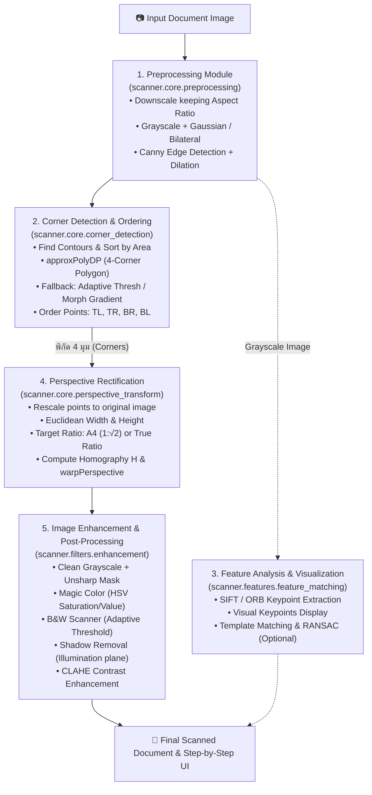

# Automatic Document Scanner & Perspective Rectifier
### ระบบสแกนเอกสารและปรับมุมมองภาพอัตโนมัติ (End-to-End Computer Vision Pipeline)

[](https://www.python.org/downloads/)
[](https://opencv.org/)
[](https://streamlit.io/)
[](LICENSE)
[](https://cp461-document-scanner-and-perspective-rectifier-tryxb6akpbhvu.streamlit.app/)

เอกสารฉบับนี้ถูกแบ่งออกเป็น **2 ส่วนหลัก (2 Sessions)** อย่างชัดเจน เพื่อความสะดวกในการศึกษาและนำไปใช้งาน:
1. **[Session 1: รายละเอียดของแอปพลิเคชันและสถาปัตยกรรมทางเทคนิค](#session-1)**
2. **[Session 2: คู่มือการติดตั้งและวิธีการใช้งาน](#session-2)**

---

<a id="session-1"></a>
# Session 1: รายละเอียดของแอปพลิเคชันและสถาปัตยกรรมทางเทคนิค (App Details & Technical Architecture)

## 1. ภาพรวมและวัตถุประสงค์ของโครงการ (Project Overview)
โครงการ **Automatic Document Scanner & Perspective Rectifier** เป็นแอปพลิเคชันคอมพิวเตอร์วิชัน (Computer Vision) แบบครบวงจร พัฒนาขึ้นสำหรับวิชา **CP461 Introduction to Computer Vision** เพื่อแก้ปัญหาภาพถ่ายเอกสารที่มีมุมมองเอียง บิดเบี้ยว มีเงาตกกระทบ หรือถ่ายในสภาวะแสงที่ไม่เอื้ออำนวย โดยระบบสามารถ:
- ค้นหาและตรวจจับขอบเขตของเอกสารในภาพโดยอัตโนมัติ
- ปรับระนาบมุมมองของเอกสารให้กลายเป็นมุมมองหน้าตรงแบบระนาบเดียวกับสายตา (Top-Down Orthogonal View) ด้วย Perspective Transformation
- ปรับสัดส่วนเอกสารให้เป็นไปตามมาตรฐานสากล เช่น สัดส่วนกระดาษ A4 หรือคงสัดส่วนจริงของเอกสารประเภทอื่น (ใบเสร็จ, นามบัตร)
- ปรับปรุงคุณภาพเอกสารด้วยฟิลเตอร์หลากหลายรูปแบบ (ลบเงา, ปรับคอนทราสต์เฉพาะจุด, สแกนขาว-ดำ คมชัด)
- มีเว็บแอปพลิเคชันที่ใช้งานง่าย รองรับ 2 ภาษา (ไทย / อังกฤษ) พร้อมระบบแสดงขั้นตอนการทำงานของ Pipeline แบบเจาะลึก

---

## 2. การเปรียบเทียบระหว่างแผนงานเดิม (Initial Plan) กับระบบจริงที่พัฒนาขึ้น (Actual Implementation)

จากเอกสารแผนงานเดิม [`Document_Scanner_Implementation_Plan (1).md`](file:///c:/Users/Tact/Documents/GitHub/CP461-Document-Scanner-And-Perspective-Rectifier/Document_Scanner_Implementation_Plan%20(1).md) โครงการได้มีการพัฒนาต่อยอดและปรับปรุงเชิงสถาปัตยกรรมเพื่อให้ระบบมีความทนทาน (Robustness) และตอบสนองการใช้งานจริงได้ดียิ่งขึ้น:

| มิติการเปรียบเทียบ | แผนงานเดิมตอนต้น (Initial Plan) | สิ่งที่พัฒนาจริงในระบบ (Actual Implementation) | เหตุผลและความได้เปรียบของการปรับเปลี่ยน |
|---|---|---|---|
| **Pipeline Workflow** | วางแผนให้ Feature Matching เป็นแกนหลักในทุกภาพ | ใช้ **Contour Polygon Detection เป็นวิธีหลัก** และมี **Multi-tier Fallback Strategy** พร้อม Feature Detection (SIFT/ORB) สำหรับการวิเคราะห์และ Visualization | เพิ่มความเร็วในการประมวลผลสูงขึ้น 5-10 เท่าในสภาวะปกติ และป้องกันกรณี Template Matching ล้มเหลวเมื่อเอกสารมีหน้าตาหลากหลาย |
| **Corner Detection & Robustness** | พึ่งพา Canny + Contour 4 เหลี่ยมมาตรฐาน | เพิ่มระบบ **Fallback Detector** 3 ชั้น (Adaptive Thresholding Contours, Morphological Gradient/Convex Hull, และ Bounding Box Fallback) | ป้องกันระบบแครชหรือหามุมไม่เจอในกรณีเอกสารมีคอนทราสต์ต่ำ แสงสะท้อน หรือขอบขาดตอน |
| **Perspective Warping** | บังคับยืดเข้าสู่สัดส่วน A4 เสมอ | มีตัวเลือก **Enforce A4 Ratio** (เปิด/ปิด ได้อิสระ) โดยหากปิดจะคำนวณสัดส่วนจากระยะยูคลิดจริงของเอกสาร | รองรับเอกสารที่ไม่ใช่ A4 เช่น สลิปใบเสร็จ, เช็คธนาคาร, นามบัตร โดยไม่บิดเบือนสัดส่วนจริง |
| **Enhancement Filters** | วางแผนฟิลเตอร์พื้นฐาน (Grayscale, Adaptive Threshold, Shadow Removal) | พัฒนาเพิ่มเป็น **6 ฟิลเตอร์สมบูรณ์แบบ**:<br>1. Original<br>2. Clean Grayscale (พร้อม Unsharp Sharpening)<br>3. Magic Color (HSV Saturation/Value Boost)<br>4. B&W Scanner (Adaptive Threshold ปรับ Block Size/C ได้)<br>5. Illumination Normalization Shadow Removal<br>6. Contrast Enhancement (CLAHE ใน L-channel ของ LAB Space) | ตอบสนองการใช้งานเอกสารทั้งประเภทข้อความ ลายเซ็น และภาพประกอบสีได้อย่างมืออาชีพ |
| **Web Interface** | เว็บแอปพลิเคชันภาษาเดียวแบบเรียบง่าย | เว็บแอปพลิเคชันแบบ Interactive พัฒนาด้วย Streamlit รองรับ **Bilingual i18n (ภาษาไทย 🇹🇭 / English 🇬🇧)** เต็มรูปแบบ พร้อมระบบ Preview ทุกฟิลเตอร์พร้อมกัน และแจกแจงพิกัด 4 มุมแบบตาราง | ยกระดับ User Experience (UX) ให้น่าประทับใจระดับ Production-ready |

---

## 3. สถาปัตยกรรมระบบ Pipeline (System Architecture & Dataflow)

ระบบประมวลผลถูกออกแบบในรูปแบบโมดูลาร์ (Modular Architecture) ภายใต้แพ็กเกจ `scanner` โดยมีโฟลว์การทำงานดังแผนภาพ:



---

## 4. รายละเอียดเชิงลึกของแต่ละโมดูล (Module Deep-Dive)

### 4.1 Preprocessing Module (`scanner.core.preprocessing.Preprocessor`)
- **การย่อขนาดภาพ (Resizing):** ปรับขนาดภาพให้อยู่ในความสูงมาตรฐาน (เช่น 800px) เพื่อให้การตรวจจับเส้นขอบรวดเร็วและคงพารามิเตอร์คงที่ โดยเก็บค่าสเกล `scale = original_height / resized_height` เพื่อนำไปคูณกลับในขั้นตอน Transform
- **Bilateral Filter vs Gaussian Blur:** ให้ตัวเลือก Bilateral Filter ซึ่งช่วยลด Noise บนกระดาษแต่ยังคงความคมชัดของขอบเส้น (Edge-preserving Smoothing)
- **Morphological Dilation:** ขยายเส้นขอบ Canny ด้วย Structuring Element ขนาด 3x3 หรือ 5x5 เพื่อเชื่อมรอยต่อของเส้นขอบกระดาษที่อาจขาดหายไป

### 4.2 Corner Detection & Ordering (`scanner.core.corner_detection.CornerDetector`)
- **Polygon Approximation:** ใช้ฟังก์ชัน `cv2.approxPolyDP` คำนวณหาเส้นรอบรูปด้วย Douglas-Peucker Algorithm โดยตั้งค่า $\epsilon = 0.02 \times \text{Perimeter}$
- **Corner Ordering:** จัดเรียงพิกัด 4 จุดให้อยู่ในลำดับคงที่เสมอ (Top-Left $\to$ Top-Right $\to$ Bottom-Right $\to$ Bottom-Left):
  - **Top-Left ($P_{tl}$):** จุดที่มีผลบวก $x + y$ ต่ำที่สุด
  - **Bottom-Right ($P_{br}$):** จุดที่มีผลบวก $x + y$ สูงที่สุด
  - **Top-Right ($P_{tr}$):** จุดที่มีผลต่าง $y - x$ ต่ำที่สุด
  - **Bottom-Left ($P_{bl}$):** จุดที่มีผลต่าง $y - x$ สูงที่สุด

### 4.3 Multi-tier Fallback Strategy (`scanner.utils.fallback.FallbackDetector`)
กรณีที่เอกสารถ่ายบนพื้นหลังที่มีสีใกล้เคียงกัน หรือแสงสะท้อนทำให้ Canny ขาดตอน ระบบจะสลับไปใช้กลยุทธ์สำรองอัตโนมัติ:
1. **Fallback Method 1 (Adaptive Thresholding Contours):** ทำการ Thresholding แบบปรับตัวตามสภาพแสงเฉพาะที่ เพื่อแยกกระดาษออกจากพื้นหลัง
2. **Fallback Method 2 (Morphological Gradient & Convex Hull):** ใช้ผลต่างของการ Dilate และ Erode เพื่อหาบริเวณขอบนอกสุด แล้วสร้าง Convex Hull 4 มุม
3. **Fallback Method 3 (Bounding Box Fallback):** กรณีที่รูปทรงบิดเบี้ยวมาก ระบบจะหา Bounding Quad เพื่อให้แน่ใจว่าไปป์ไลน์สามารถทำงานต่อได้โดยไม่เกิดข้อผิดพลาด

### 4.4 Feature Matching & Homography Matrix (`scanner.features.feature_matching.FeatureMatcher`)
- **SIFT (Scale-Invariant Feature Transform):** สกัด Local Feature Descriptors ขนาด 128 มิติ ทนทานต่อการหมุน (Rotation), การเปลี่ยนขนาด (Scale), และความสว่าง (Illumination)
- **ORB (Oriented FAST and Rotated BRIEF):** อัลกอริทึมทางเลือกที่ประมวลผลได้รวดเร็ว เหมาะสำหรับอุปกรณ์ที่มีทรัพยากรจำกัด
- **Lowe's Ratio Test:** กรองคู่ Keypoint ที่ดีด้วยเงื่อนไข $d_1 < 0.75 \times d_2$
- **RANSAC (Random Sample Consensus):** คัดแยก Outliers ที่เกิดจากสิ่งรบกวนบนหน้ากระดาษ และคำนวณ Homography Matrix $3 \times 3$ ที่แท้จริง:

$$P_{\text{target}} \sim H \cdot P_{\text{source}}$$

$$\begin{bmatrix} x' \\ y' \\ 1 \end{bmatrix} \sim \begin{bmatrix} h_{11} & h_{12} & h_{13} \\ h_{21} & h_{22} & h_{23} \\ h_{31} & h_{32} & h_{33} \end{bmatrix} \begin{bmatrix} x \\ y \\ 1 \end{bmatrix}$$

### 4.5 Perspective Rectification (`scanner.core.perspective_transform.PerspectiveTransformer`)
- คำนวณความกว้าง ($W$) และความสูง ($H$) จริงของเอกสารจากระยะห่างยูคลิด (Euclidean Distance):

$$W = \max\left(\sqrt{(x_{br} - x_{bl})^2 + (y_{br} - y_{bl})^2}, \; \sqrt{(x_{tr} - x_{tl})^2 + (y_{tr} - y_{tl})^2}\right)$$

$$H = \max\left(\sqrt{(x_{tr} - x_{br})^2 + (y_{tr} - y_{br})^2}, \; \sqrt{(x_{tl} - x_{bl})^2 + (y_{tl} - y_{bl})^2}\right)$$

- **Enforce A4 Ratio:** หากเปิดใช้งาน จะคงความกว้าง $W$ และปรับความสูงเป็น $H = W \times \sqrt{2} \approx W \times 1.4142$
- คำนวณ Transformation Matrix ด้วย `cv2.getPerspectiveTransform` และดัดมุมมองภาพความละเอียดสูงด้วย `cv2.warpPerspective`

### 4.6 Enhancement Filters (`scanner.filters.enhancement.ImageEnhancer`)
1. **Original:** ภาพผลลัพธ์จากการดัดมุมมองโดยไม่ใส่ฟิลเตอร์
2. **Clean Grayscale:** แปลงเป็นเฉดสีเทา พร้อมปรับความคมชัดของฟอนต์ตัวหนังสือด้วย Unsharp Sharpening Kernel:
   ```text
   [  0.0  -0.5   0.0 ]
   [ -0.5   3.0  -0.5 ]
   [  0.0  -0.5   0.0 ]
   ```
3. **Magic Color:** แปลงภาพสู่ HSV Color Space ปรับ Saturation $\times 1.5$ และ Value $\times 1.2$ เพื่อให้ตัวหนังสือและภาพประกอบสีมีความสดใสเสมือนเอกสารต้นฉบับ
4. **B&W Scanner:** แปลงเป็นภาพขาว-ดำ แบบสแกนเนอร์สำนักงาน ด้วย Adaptive Thresholding (Gaussian / Mean) โดยปรับ Block Size และค่าชดเชย $C$ ได้ตามต้องการ
5. **Shadow Removal:** กำจัดเงาตกกระทบด้วยการประมาณพื้นผิวแสงสว่าง (Illumination Plane Estimation) ผ่าน Morphological Dilation ขนาดใหญ่ร่วมกับ Median Blur แล้วนำภาพต้นฉบับมาลบออกและทำ Normalization
6. **Contrast Enhancement (CLAHE):** แปลงภาพสู่ CIE-LAB Color Space และนำ L-channel (Lightness) มาผ่าน Contrast Limited Adaptive Histogram Equalization เพื่อเร่งความชัดเจนของตัวอักษรโดยไม่ทำให้ภาพแตก

---

## 5. โครงสร้างโฟลเดอร์ของโปรเจกต์ (Project Structure)

```text
CP461-Document-Scanner-And-Perspective-Rectifier/
├── app.py                     # Streamlit Web Application (Bilingual UI, Controllers)
├── requirements.txt           # Python Dependencies (OpenCV, Streamlit, NumPy, Pillow)
├── README.md                  # เอกสารโครงการ (Session 1: Details & Session 2: User Guide)
├── Document_Scanner_Implementation_Plan (1).md # แผนงานการพัฒนาฉบับตั้งต้น
│
├── scanner/                   # Core Computer Vision Engine
│   ├── __init__.py            # Module Interface & Versioning
│   ├── pipeline.py            # DocumentScanner Orchestrator
│   ├── core/                  # Core Processing Steps
│   │   ├── preprocessing.py       # Grayscale, Resizing, Blurring, Canny Edges
│   │   ├── corner_detection.py    # Contour Approximations & Corner Ordering
│   │   └── perspective_transform.py # Warping & A4 Aspect Ratio Calculations
│   ├── features/              # Feature Detection & Homography
│   │   └── feature_matching.py    # SIFT/ORB Keypoint Extraction, Flann, RANSAC
│   ├── filters/               # Post-Processing Filters
│   │   └── enhancement.py         # 6 Enhancement Filters (CLAHE, Shadow, B&W, etc.)
│   └── utils/                 # Resiliency & Fallback
│       └── fallback.py            # Adaptive & Gradient Fallback Detectors
│
├── test_images/               # ชุดภาพถ่ายเอกสารสำหรับทดสอบ (เอียง, มีเงา, แสงน้อย)
├── notebooks/                 # Jupyter/Colab Notebooks สำหรับทดลอง Algorithm
└── tests/                     # Automated Unit Tests
```

---

<a id="session-2"></a>
# Session 2: คู่มือการติดตั้งและวิธีการใช้งาน (User Guide & Step-by-Step Manual)

## 0. ทดลองใช้งานออนไลน์ (Live Demo — No Installation Required)

> **แอปพลิเคชันถูก Deploy บน Streamlit Community Cloud แล้ว** ไม่ต้องติดตั้งอะไรเพิ่มเติม สามารถทดลองใช้งานได้ทันที:

🚀 **[https://cp461-document-scanner-and-perspective-rectifier-tryxb6akpbhvu.streamlit.app/](https://cp461-document-scanner-and-perspective-rectifier-tryxb6akpbhvu.streamlit.app/)**

| รายละเอียด | ข้อมูล |
|---|---|
| **Platform** | Streamlit Community Cloud |
| **URL** | https://cp461-document-scanner-and-perspective-rectifier-tryxb6akpbhvu.streamlit.app/ |
| **ความพร้อมใช้งาน** | ออนไลน์ตลอดเวลา (Public Access) |
| **ข้อจำกัด** | ทรัพยากรจำกัดตาม Free Tier — หากแอปหยุดนิ่ง กด **"Wake up app"** เพื่อเริ่มใหม่ |

> *หากต้องการรันบนเครื่องของตัวเองเพื่อประสิทธิภาพสูงสุด ให้ทำตามขั้นตอนด้านล่าง*

---

## 1. ข้อกำหนดของระบบ (System Requirements)
- **ระบบปฏิบัติการ:** Windows 10/11, macOS (Intel / Apple Silicon), หรือ Linux (Ubuntu 20.04+)
- **Python:** เวอร์ชัน **3.9 ถึง 3.12** (ดาวน์โหลดจาก [python.org](https://www.python.org/downloads/))
  - *สำหรับผู้ใช้ Windows: ในหน้าต่างติดตั้ง ให้เลือกติ๊กถูกที่ช่อง **"Add Python to PATH"** เสมอ*

---

## 2. ขั้นตอนการติดตั้งอย่างละเอียด (Step-by-Step Installation)

### ขั้นตอนที่ 1: Clone หรือดาวน์โหลดโปรเจกต์
เปิด Terminal (macOS/Linux) หรือ PowerShell (Windows) แล้วพิมพ์คำสั่ง:
```bash
git clone https://github.com/GOATAP23/CP461-Document-Scanner-And-Perspective-Rectifier.git
cd CP461-Document-Scanner-And-Perspective-Rectifier
```

### ขั้นตอนที่ 2: สร้างและเปิดใช้งาน Virtual Environment (แนะนำอย่างยิ่ง)
การสร้าง Virtual Environment ช่วยป้องกันการชนกันของเวอร์ชันไลบรารี:

- **Windows (PowerShell):**
  ```powershell
  python -m venv venv
  .\venv\Scripts\Activate.ps1
  ```
  *(หากขึ้นเตือนข้อผิดพลาดเรื่องสิทธิ์ Execution Policy ให้รัน `Set-ExecutionPolicy -Scope Process -ExecutionPolicy Bypass` ก่อนใช้งาน)*

- **Windows (Command Prompt / CMD):**
  ```cmd
  python -m venv venv
  venv\Scripts\activate.bat
  ```

- **macOS / Linux:**
  ```bash
  python3 -m venv venv
  source venv/bin/activate
  ```

### ขั้นตอนที่ 3: ติดตั้ง Dependencies
ติดตั้งชุดไลบรารีที่จำเป็นทั้งหมดตาม `requirements.txt`:
```bash
python -m pip install --upgrade pip
pip install -r requirements.txt
```
*(หากคำสั่ง `python` มีปัญหาบน Windows ให้ใช้คำสั่ง `py -m pip install -r requirements.txt` แทน)*

---

## 3. วิธีการรันแอปพลิเคชัน (How to Run the Application)

เพื่อให้มั่นใจว่าระบบจะเรียกใช้ Streamlit ที่ติดตั้งอยู่ในสภาพแวดล้อม Python ที่ถูกต้องอย่างแน่นอน แนะนำให้รันด้วยคำสั่งผ่านโมดูล Python โดยตรง:

```bash
# คำสั่งสำหรับ Windows (แนะนำ):
py -m streamlit run app.py

# คำสั่งมาตรฐานทั่วไป (Windows / macOS / Linux):
python -m streamlit run app.py
```

เมื่อเริ่มต้นระบบสำเร็จ เบราว์เซอร์จะเปิดหน้าเว็บให้อัตโนมัติที่ URL:
```text
http://localhost:8501
```

---

## 4. คู่มือการใช้งานบน Web UI ทีละขั้นตอน (User Guide)

```text
┌─────────────────────────────────────────────────────────────────────────────┐
│  [Sidebar]                           [Main Dashboard]                       │
│  🌐 เลือกภาษา: 🇹🇭 Thai / 🇬🇧 English     📄 Glassmorphic App Header              │
│                                      ┌───────────────────────────────────┐  │
│  ⚙️ Scanner Settings:                 │ 📤 Drag and Drop Image File       │  │
│    • SIFT / ORB                      └───────────────────────────────────┘  │
│    • Enforce A4 Ratio [✓]                                                   │
│    • Canny / Blur Sliders            📊 Stat Cards (4 ช่อง):                │
│    • Filter: B&W / Magic / Shadow         Method | Keypoints | Size | Algo  │
│                                                                             │
│                                      🖼️ 2-Column Comparative View:          │
│                                      [Original] │ [Enhanced + Filter Label] │
│                                                 │ [⬇️ Download Scanned PNG]  │
│                                                                             │
│                                      🔬 Pipeline Inspection (Steps 1 – 4)   │
│                                      🎨 Enhancement Filter Gallery (6 ฟิลเตอร์)│
│                                      📋 Pipeline Execution Summary Log      │
└─────────────────────────────────────────────────────────────────────────────┘
```

### ขั้นตอนที่ 1: เลือกภาษาของระบบ (Language Selection)
- มองไปที่มุมซ้ายบนของเมนูด้านข้าง (Sidebar)
- คลิกปุ่ม **🇹🇭 ภาษาไทย** หรือ **🇬🇧 English** เพื่อเปลี่ยนภาษาของป้ายคำอธิบาย สถิติ และข้อความแนะนำทั้งหมดบนหน้าจอแบบเรียลไทม์

### ขั้นตอนที่ 2: อัปโหลดภาพถ่ายเอกสาร (Image Upload)
- ลากไฟล์ภาพถ่ายเอกสารมาวางในกรอบ **"Upload a document image"** หรือคลิก **"Browse files"**
- รองรับไฟล์สกุลภาพยอดนิยมทั้งหมด: `.jpg`, `.jpeg`, `.png`, `.bmp`, `.tiff`, `.webp`
- เมื่ออัปโหลดเสร็จ ระบบจะประมวลผล Pipeline อัตโนมัติทันทีภายใน 1-2 วินาที

### ขั้นตอนที่ 3: ตรวจสอบแถบข้อมูลสรุปและภาพเปรียบเทียบ (Results & Stats)
เมื่อสแกนสำเร็จ หน้าจอจะแสดง:
1. **การ์ดสถิติ 4 ช่อง (Statistics Cards):**
   - **Detection Method:** วิธีที่ตรวจจับขอบได้สำเร็จ (Contour Detection หรือ Fallback Mode)
   - **Keypoints Detected:** จำนวนจุดเด่นภาพที่ตรวจพบ
   - **Document Size:** ขนาดความกว้าง $\times$ ความสูงจริงของเอกสารผลลัพธ์ (หน่วยพิกเซล)
   - **Feature Method:** อัลกอริทึมที่เลือกใช้ (`SIFT` หรือ `ORB`)
2. **การเปรียบเทียบภาพ 3 มุมมอง (Comparative View):**
   - **Original:** ภาพถ่ายต้นฉบับก่อนสแกน
   - **Rectified (Warped):** ภาพที่ดัดปรับระนาบหน้าตรงแล้ว (ยังไม่ผ่านฟิลเตอร์)
   - **Enhanced Output:** ภาพที่ผ่านการปรับปรุงคุณภาพด้วยฟิลเตอร์ที่เลือกไว้

### ขั้นตอนที่ 4: ดาวน์โหลดเอกสารผลลัพธ์ (Download)
- คลิกปุ่ม **"⬇️ ดาวน์โหลดภาพสแกนเอกสาร (PNG)"** / **"Download Scanned Document"** ที่อยู่ใต้ภาพเปรียบเทียบ เพื่อบันทึกภาพคุณภาพสูงลงในเครื่อง

---

## 5. การปรับแต่งพารามิเตอร์บน Sidebar (Parameter Tuning Cheatsheet)

หากภาพเอกสารมีความซับซ้อน สามารถปรับแต่งค่าบนเมนูด้านซ้ายเพื่อเพิ่มความแม่นยำ:

| หมวดหมู่ (Category) | พารามิเตอร์ (Parameter) | ค่าตั้งต้น (Default) | คำอธิบายและคำแนะนำการใช้งาน |
|---|---|---|---|
| **Detection** | **Feature Method** | `SIFT` | - `SIFT`: แม่นยำสูง เหมาะกับภาพที่เอียงมากหรือมีแสงสะท้อน<br>- `ORB`: ประมวลผลเร็วกว่า เหมาะกับเครื่องที่สเปกไม่สูง |
| **Detection** | **Enforce A4 Ratio** | `True` (ติ๊กถูก) | - **เปิด (True):** ปรับแก้สัดส่วนให้อยู่ในอัตราส่วน $1 : \sqrt{2}$ (กระดาษ A4 มาตรฐาน)<br>- **ปิด (False):** รักษาสัดส่วนจริงของเอกสาร เช่น ใบเสร็จ สลิปยาว หรือนามบัตร |
| **Preprocessing** | **Canny Low / High** | `50 / 200` | ปรับระดับความไวของการตรวจจับขอบ หากขอบกระดาษไม่ชัดให้ลดค่า Low ลง หากมี Noise มากให้เพิ่มค่าทั้งสองขึ้น |
| **Preprocessing** | **Blur Kernel Size** | `5` | ปรับขนาดการเบลอลดจุดรบกวน (ต้องเป็นเลขคี่เสมอ: 3, 5, 7, 9) |
| **Preprocessing** | **Use Bilateral Filter** | `False` | เปิดใช้งานเมื่อต้องการลด Noise บนกระดาษแต่ต้องการรักษาความคมของขอบตัวหนังสือและขอบเอกสาร |
| **Enhancement** | **Output Filter** | `original` | เลือกรูปแบบการปรับปรุงภาพ (Original, Grayscale, Magic Color, B&W Scanner, Shadow Removal, Contrast Enhanced) |
| **B&W Options** | **Block Size & C Value** | `21 / 10` | *(แสดงเมื่อเลือก B&W Scanner)*<br>- **Block Size:** ขนาดพื้นที่รอบจุดในการคำนวณ Threshold<br>- **C Value:** ค่าชดเชยความสว่าง หากภาพดำเกินไปให้เพิ่มค่า C หากตัวหนังสือขาดให้ลดค่า C |

---

## 6. เครื่องมือการวิเคราะห์และตรวจสอบ Pipeline (Advanced Visualizations)

ผู้ใช้สามารถกดเปิดแท็บพิเศษเพื่อศึกษาขั้นตอนการทำงานทาง Computer Vision ได้:

### 1. แท็บขั้นตอนการทำงาน (Pipeline Visualization — Step by Step)
- **Step 1: Preprocessing:** แสดงภาพ Grayscale, Gaussian Blurred, และ Canny Edge Map
- **Step 2: Corner Detection:** แสดงภาพ Dilated Edges, ภาพวาดจุดมุมทั้ง 4 พร้อม **ตารางพิกัดจริง ($X, Y$)** ของมุมบน-ซ้าย, บน-ขวา, ล่าง-ขวา, และล่าง-ซ้าย
- **Step 3: Feature Detection (Keypoints):** แสดงภาพจุด Feature Keypoints สีสันตามความแรงของ Gradient
- **Step 4: Homography Matrix:** แสดงตารางเมทริกซ์ $3 \times 3$ ที่ใช้ในการ Transform พิกัดจริง พร้อมสูตรคณิตศาสตร์กำกับ

### 2. แท็บเปรียบเทียบทุกฟิลเตอร์พร้อมกัน (All Enhancement Filters Preview)
- แสดงผลลัพธ์ของภาพสแกนพร้อมกันทั้ง 6 สไตล์ในตาราง Grid แบบ 3 คอลัมน์ ช่วยให้ผู้ใช้เปรียบเทียบและเลือกฟิลเตอร์ที่ชอบที่สุดได้ทันที

### 3. แท็บสรุปการประมวลผล (Pipeline Summary Log)
- บันทึก Log รายละเอียดของภาพ ขนาดดั้งเดิม ขนาดหลังดัดมุม และโมเดลที่ใช้ประมวลผลในรูปแบบข้อความดิบ

---

## 7. เทคนิคการถ่ายภาพเพื่อให้ได้ผลลัพธ์ดีที่สุด (Best Practices for Input Images)
1. **ความคมชัดของพื้นหลัง (Background Contrast):** วางเอกสารบนพื้นผิวโต๊ะหรือพื้นหลังที่มีสีตัดกับกระดาษ เช่น กระดาษสีขาววางบนโต๊ะไม้สีเข้ม หรือโต๊ะสีทึบ
2. **มุมมองการถ่าย (Capture Angle):** ควรถ่ายให้เห็นขอบกระดาษครบทั้ง 4 มุม ไม่ควรให้มีสิ่งของมาบังมุมใดมุมหนึ่ง
3. **แสงสว่าง (Illumination):** หลีกเลี่ยงเงาขนาดใหญ่พาดผ่านเอกสารขณะถ่าย (หากเลี่ยงไม่ได้ ให้เปิดใช้งานฟิลเตอร์ **Shadow Removal**)

---

## 8. การแก้ไขปัญหาที่พบบ่อย (Troubleshooting & FAQs)

- **Q1: รันคำสั่งแล้วขึ้นว่า `python` หรือ `streamlit` not recognized หรือ command not found?**
  - **วิธีแก้:** สำหรับ Windows ให้ใช้ Python Launcher รันด้วยคำสั่ง:
    ```bash
    py -m streamlit run app.py
    ```
    หรือหากอยู่ใน Virtual Environment ให้ตรวจสอบว่าได้ Activate สภาพแวดล้อมแล้วหรือไม่ (`.\venv\Scripts\activate`)
- **Q2: ระบบตรวจจับขอบกระดาษผิด หรือตรวจจับไปโดนกรอบโต๊ะแทน?**
  - **วิธีแก้:** เลื่อนปรับแถบ **Canny Low Threshold** หรือ **Canny High Threshold** บน Sidebar เพื่อให้ระบบจับเฉพาะเส้นขอบกระดาษที่ชัดเจน หรือเลือกเปลี่ยนรูปภาพที่มีพื้นหลังตัดกับกระดาษมากขึ้น
- **Q3: ภาพสแกนเอกสารยาว (เช่น สลิป 7-Eleven) ออกมาแล้วหดสั้นหรือสัดส่วนเพี้ยน?**
  - **วิธีแก้:** นำเครื่องหมายติ๊กถูกออกจากช่อง **"Enforce A4 Ratio (1:√2)"** ที่ Sidebar เพื่อให้ระบบรักษาสัดส่วนจริงของเอกสาร
- **Q4: ตัวหนังสือในฟิลเตอร์ B&W Scanner ขาดหรือจางเกินไป?**
  - **วิธีแก้:** ปรับลดค่า **C Value** ลงมาอยู่ที่ประมาณ 5-7 หรือเพิ่มขนาด **Block Size** ขึ้นเป็น 25-31

---

## สิทธิ์การใช้งานและการอ้างอิง (License & Credits)
- พัฒนาขึ้นเพื่อการศึกษาในรายวิชา **CP461 Introduction to Computer Vision**
- เครื่องมือและไลบรารีหลัก: [OpenCV](https://opencv.org/), [Streamlit](https://streamlit.io/), [NumPy](https://numpy.org/)
- อนุญาตให้ใช้งานและปรับปรุงต่อยอดได้ภายใต้ข้อกำหนดการศึกษา
